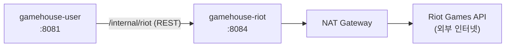

# gamehouse-riot

GameHouse의 **Riot API 연동** 서비스. 소환사 정보·티어·챔피언 숙련도를 라이엇에서 받아와
내부 서비스에 돌려준다. 외부 API 호출을 이 한 곳에 가둬 두기 위한 서비스다.

---

## 1. 좌표

GameHouse는 서비스별로 레포가 분리된 MSA다. 이 레포는 그중 `riot` 하나다.

| 서비스 | 포트 | 담당 |
|---|---|---|
| `gamehouse-user` | 8081 | 회원·인증·친구·알림 |
| `gamehouse-post` | 8082 | 모집글·파티 |
| `gamehouse-chat` | 8083 | 1:1 · 파티 채팅 |
| **`gamehouse-riot`** | **8084** | **Riot API 연동** |
| `gamehouse-match` | 8085 | AI Team Fit 추천 |
| `gamehouse-crew` | 8086 | 하우스(크루) |

공통 코드(JWT 검증, 전역 예외 처리, 이벤트 계약)는 `gamehouse-common`을
GitHub Packages에서 받아 쓴다. 배포 매니페스트는 `infra` 레포에 있다.

---

## 2. 서비스 관계도

**다른 서비스와 다른 점이 셋 있다.**

- **DB가 없다.** 라이엇에서 받은 값을 그대로 돌려줄 뿐 저장하지 않는다.
- **이벤트를 쓰지 않는다** (`gamehouse.events.enabled: false`).
- **프론트엔드가 직접 부르지 않는다.** `/internal/riot` 만 열려 있고 ALB Ingress에도
  riot 경로가 없다. 유저 화면에서 오는 요청은 반드시 user 서비스를 거친다.

라이엇 API는 AWS 서비스가 아니므로 VPC Endpoint로 대체할 수 없다.
프라이빗 서브넷에서 NAT Gateway를 통해 나간다 — 클러스터가 NAT를 유지하는 이유다.

---

## 3. 담당 도메인

| 도메인 | 하는 일 |
|---|---|
| **계정 조회** | Riot ID(게임명 + 태그) → PUUID 변환 |
| **소환사 정보** | 레벨 · 아이콘 등 기본 프로필 |
| **티어** | 랭크 게임 티어와 승패 기록 |
| **챔피언 숙련도** | 숙련도 상위 챔피언 목록 |
| **호출량 제한** | 2분당 90회로 자체 제한 — 라이엇 쿼터를 넘기지 않기 위해 |
